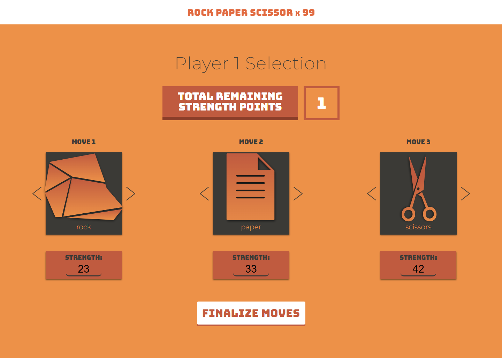

# Rock Paper Scissors x99



---

## Overview

**Rock Paper Scissors x99** is a strategic and enhanced version of the classic **Rock Paper Scissors** game. In this game, each player selects **three moves** and distributes a total of **99 strength points** across these moves. Each round compares both the move type and its strength value to determine the winner.

This project was developed as part of the **[Create a Back-End App with JavaScript Skill Path](https://www.codecademy.com/learn/paths/create-a-back-end-app-with-javascript)** offered by [Codecademy](https://www.codecademy.com/).

👉 Try the live version here: [https://rock-paper-scissors-x99.vercel.app](https://rock-paper-scissors-x99.vercel.app)

---

## Game Rules

- Each player defines **3 moves**:
    - **Type:** `rock`, `paper`, or `scissors`
    - **Value:** an integer strength value for each move

- The total strength points across the three moves must equal exactly **99**.
- Each move must have at least **1 point**.

### How Each Round Works:

1.  If the move types differ:
    -   Rock beats Scissors
    -   Scissors beats Paper
    -   Paper beats Rock
2.  If the move types are the same:
    -   The move with the **higher strength value** wins.
3.  If both moves have the same type and strength:
    -   The round is declared a **tie**.

The player who wins the **majority of the three rounds** wins the game.

---

## Features

-   🔹 Set player moves manually with:
    `setPlayerMoves(player, moveOneType, moveOneValue, moveTwoType, moveTwoValue, moveThreeType, moveThreeValue)`

-   🔹 Determine the winner of a specific round with:
    `getRoundWinner(roundNumber)`

-   🔹 Determine the overall game winner with:
    `getGameWinner()`

-   🔹 Play against the computer using randomly generated valid moves with:
    `setComputerMoves()`

---

## Technologies Used

-   JavaScript (ES6+)
-   Simple HTML/CSS for the interface
-   Automated testing with:
    -   [Mocha](https://mochajs.org/)
    -   [Chai](https://www.chaijs.com/)

---

## How to Run This Project

1.  Clone this repository:
    ```bash
    git clone https://github.com/Robson16/rock-paper-scissors-x99.git
    cd rock-paper-scissors-x99
    ```
2.  Install development dependencies:
    ```bash
    npm install
    ```
3.  Run automated tests:
    ```bash
    npm run test
    ```
4.  To play the game, open the `index.html` file in your web browser. I recommend using the latest version of Google Chrome for best compatibility.

---

## Useful Links

🔗 Live Demo: https://rock-paper-scissors-x99.vercel.app

🔗 GitHub Repository: https://github.com/Robson16/rock-paper-scissors-x99

📚 Related Course: Create a Back-End App with JavaScript

---

## License

This project is licensed under the MIT License.
Developed by Robson16.